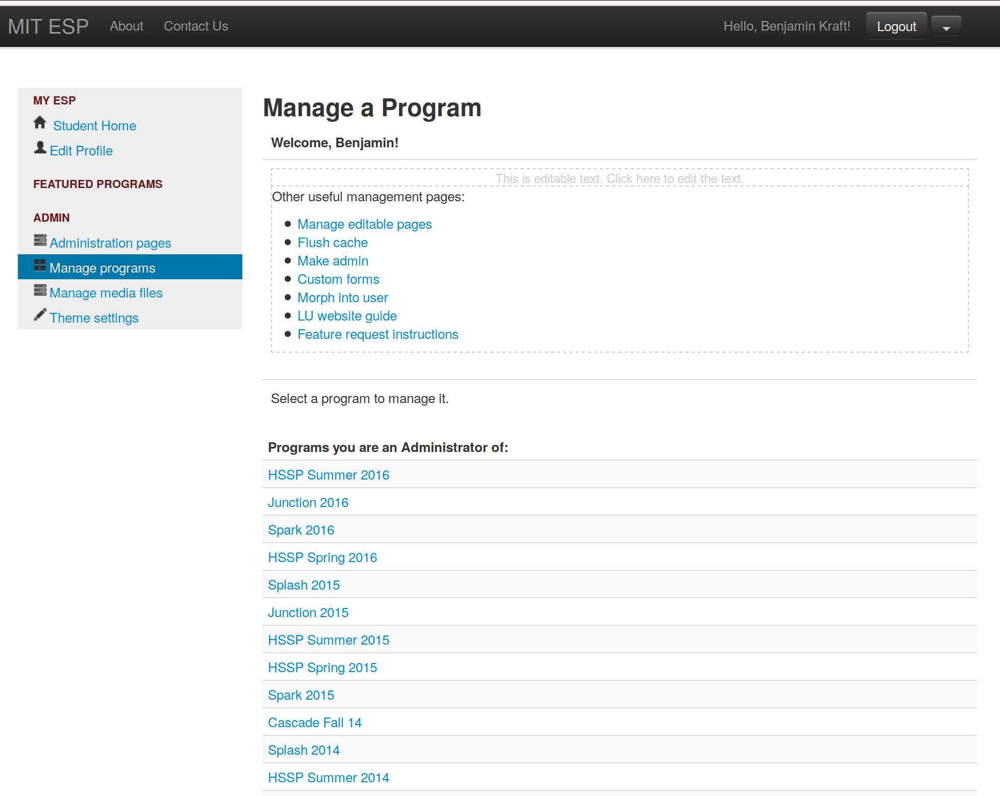
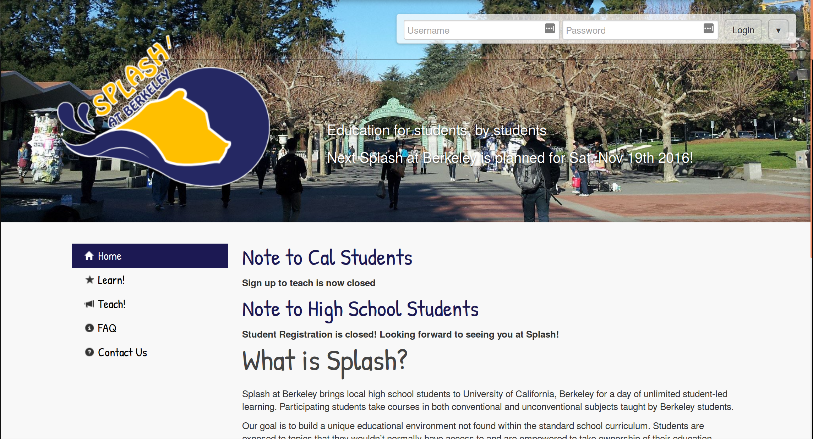
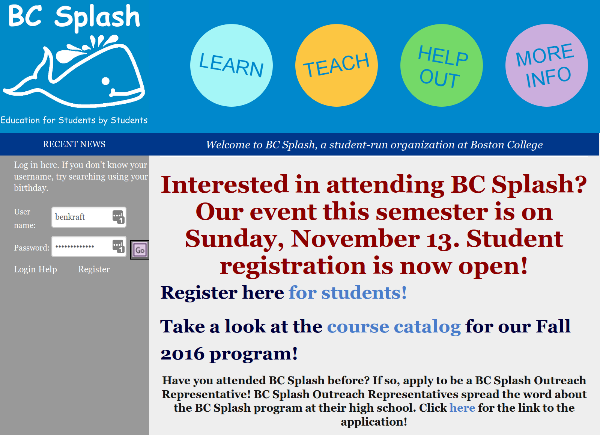
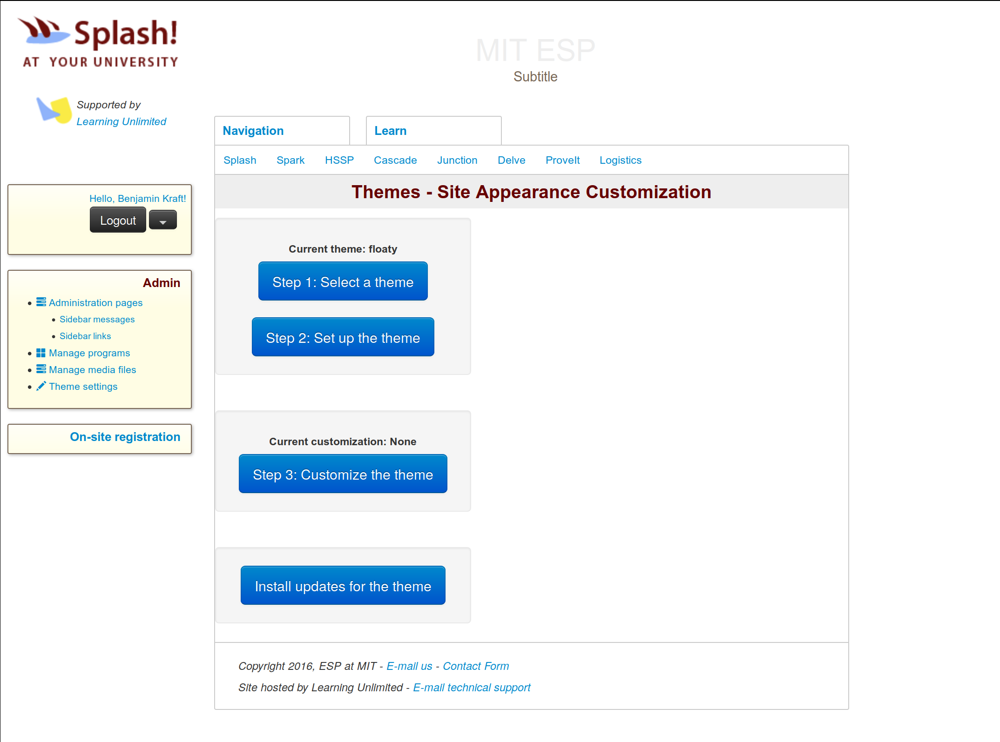
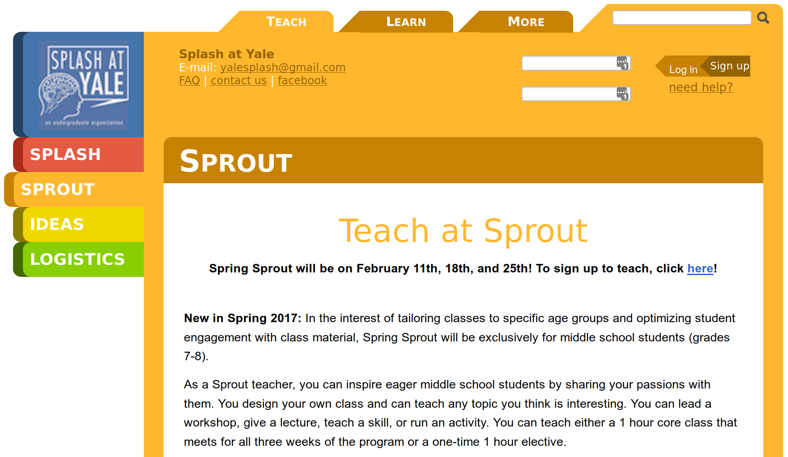

================
Available Themes
================

This page describes the currently available `Themes <themes.rst>`_ for the ESP
website.  To change the theme of your site, see `Themes <themes.rst>`_.  If you
don't like any of these themes, check out the `dev docs <../dev/themes.rst>`_
for information on making your own.

.. contents:: :local:

barebones
=========

   "barebones" theme on a sample site

True to its name, "barebones" is the simplest of the available themes.  It's
not fancy, but it requires little configuration and looks reasonably modern.

bigpicture
==========

   "bigpicture" theme on Splash at Berkeley's site

Our newest theme, "bigpicture", looks the most modern.  It requires a bit more
setup (for the picture at the top and the navbars) than some of the simpler
themes, but is still great for new chapters.  It's based the Splash at Berkeley
theme, written by Sean Zhu.

circles
=======

   "circles" theme on BC Splash's site

Originally used by Chicago Splash, "circles" has historically been one of the
more popular themes for small chapters.  It has a fairly simple navigation
structure and several options to customize the look to the chapter's
preferences.

floaty
======

   "floaty" theme on a sample site

The "floaty" theme has a somewhat fancier design than "barebones", and one
that's somewhat more modern than "circles", but also allows enough structure to
support somewhat more complex navigation.

fruitsalad
==========

   "fruitsalad" theme on a sample site

Originally designed by MIT ESP to support its many programs, the "fruitsalad"
theme has the most complex navigation options, and is best for larger
organizations that run several programs.  It can support up to 3 levels of
navigation (the tabs at the top, usually "learn" and "teach"; the tabs at the
side, often for programs or different pages; and the navbar below the page
title within each of those sections, not shown on the Yale site).  However, it
tends to be needlessly complicated for smaller sites that just want to show a
few pages.
