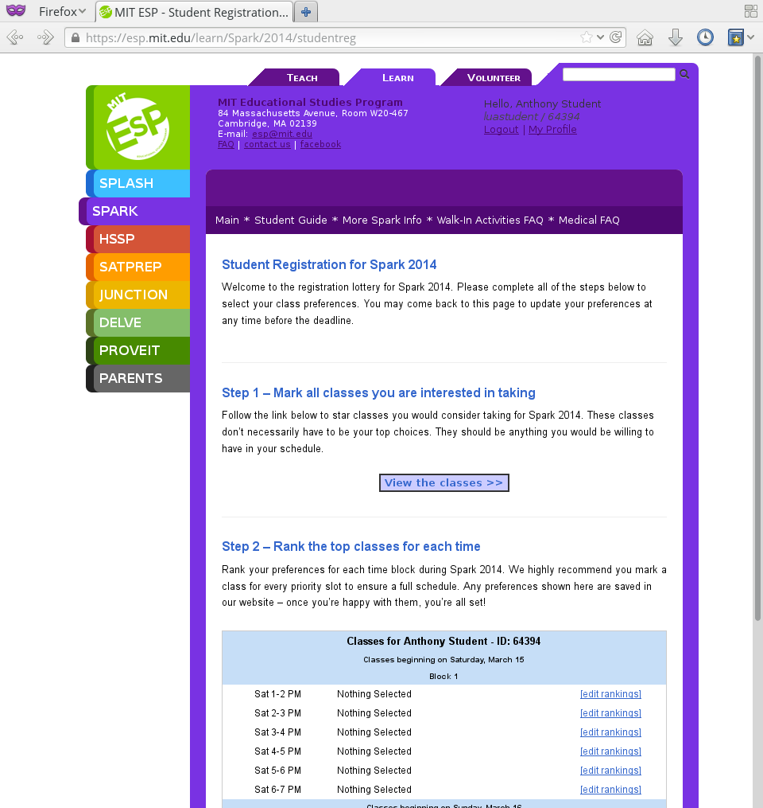
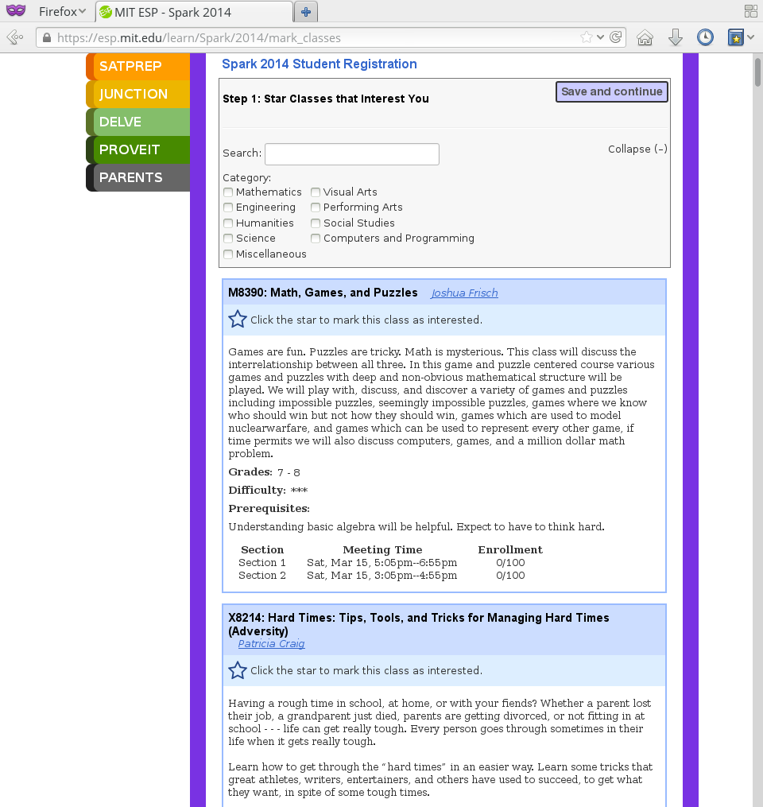
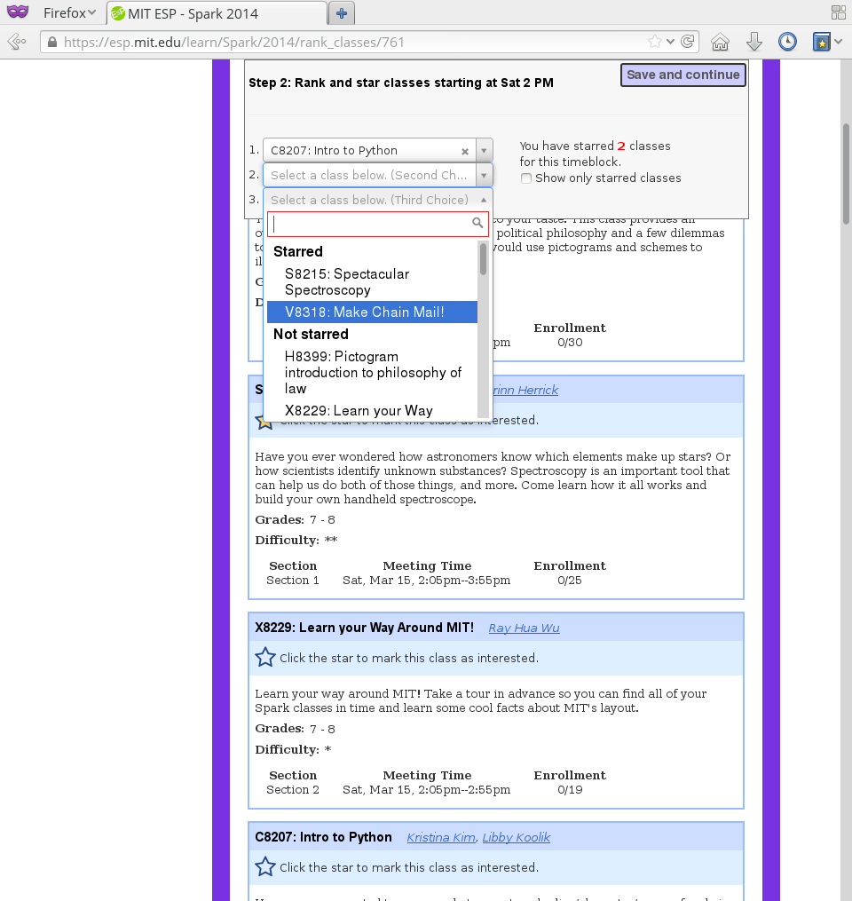

=================
Program modules
=================

.. contents:: :local:

When you create a program, your primary means of controlling the registration process is to choose which program modules to include.  Each program module corresponds to a "view" that users will be able (or perhaps compelled) to see when they are registering.

You may select which program modules to include on the program creation form at http://[hostname]/manage/newprogram.  After a program has been created, you can select which modules to include within the administration pages; go to http://[hostname]/admin/program/program/, select your program and edit the "Program modules" multi-select field.

You can also change the displayed name of program modules at http://[hostname]/admin/program/programmodule/.

More background on program modules
==================================

Program modules are broken down into the following categories:

* Student modules - http://[hostname]/learn/[program]/[instance]/*
* Teacher modules - http://[hostname]/teach/[program]/[instance]/*
* Management modules - http://[hostname]/manage/[program]/[instance]/*
* Onsite modules - http://[hostname]/onsite/[program]/[instance]/*
* Volunteer modules - http://[hostname]/volunteer/[program]/[instance]/*

Once you associate a module with a program, a "program module object" is created that allows you to customize the module's behavior for that specific program.  These objects may be edited at http://[hostname]/admin/modules/programmoduleobj/. The following settings can be changed:

* seq (Sequence number) - Determines the ordering in which users see this module.  Modules are displayed in order of increasing sequence number.
* required - Check this box to make the module required.  If the module is required, users will be directed through its view before reaching the main registration page.
* required_label - A string may be entered here to clarify your requirements for the module beyond simply being "required" or "not required."  For example, you could uncheck the required field but set required_label to "Required for outside teachers" on the teacher biography module.

You will also see references to other data structures that store configuration settings relevant to program modules:

* [Teacher] module control (ClassRegModuleInfo): http://[hostname]/admin/modules/classregmoduleinfo/
* Student module control (StudentClassRegModuleInfo): http://[hostname]/admin/modules/studentclassregmoduleinfo/
* Tags: http://[hostname]/admin/tagdict/tag/ - Very powerful, but more advanced; see [[Customize behavior with Tags]] for more information.

Below we provide a more detailed explanation of what each program module is for and which settings can be used to adjust it.

Student modules
===============

Student Acknowledgement (StudentAcknowledgementModule)
------------------------------------------------------

Include this module if you would like students to submit a somewhat scary-looking form where they agree to some conditions (e.g. a code of conduct) during student registration.

Extra Registration Info (CustomFormModule)
------------------------------------------

This module can be used in teacher and/or student registration to add a custom form into the registration process.  This can be helpful if you want to collect information (e.g. about dietary restrictions or demographics) that is not collected by the other program modules.  To use it:
1) Create a custom form at /customforms/.  Once you have submitted the form, take note of its integer ID (in the link to fill out the form, it will be /customforms/view/[ID]).
2) Create a Tag (/admin/tagdict/tag/add/) called either "learn_extraform_id" (students) or "teach_extraform_id" (teachers), with the form ID as its value.
3) (Optional) Associate the desired program with this Tag by selecting "Program" as the content type and the program ID as the object ID.
4) To view results, use the main custom forms page at /customforms/.

Financial Aid Application (FinancialAidAppModule)
-------------------------------------------------

We recommend that you include this module in all programs.  It will add a step to registration for students so that they can request financial aid.  You will be emailed whenever someone submits the form.  Students indicating that they receive free or reduced price lunch at school will automatically be granted financial aid.

To review financial aid applications, go to /admin/ and click "Financial aid requests" under
"Program"; if you would like to grant financial aid, fill out the form at the
bottom of the page under "Financial aid grant."  You can specify the grant as either a dollar amount or a percentage of the program cost.  Typically you will specify 100% of the program cost so that the student does not have to pay for the program regardless of their choices.

Formstack medical/liability forms (FormstackMedLiabModule)
----------------------------------------------------------

We are not permitted to directly handle sensitive information such as medical insurance information (just as we are not permitted to see credit card numbers).  If you need students to submit this type of information, you can use a secure 3rd party service (Formstack) along with this module:
1) Create your form on Formstack.
2) Create (program-specific) Tags with the form ID and viewing key as "formstack_id" and "formstack_viewkey" respectively.
3) Configure Formstack to POST an acknowledgement of each form submission to /learn/[program]/[instance]/medicalpostback581309742.

This registration step is controlled by the FormstackMedliab deadline type.

Lottery Student Registration (LotteryStudentRegModule)
------------------------------------------------------

There are two options for a "lottery" registration where students select their classes of interest and are later assigned to classes by the Web site.  This option shows students a list of classes beginning in each time slot and allows them to choose.  After saving their preferences they are taken back to the main student reg page (where they can fill out other parts of registration if the deadlines are open).

If you are using this module, make sure the StudentClassRegModule is not enabled at the same time.  Add only LotteryStudentRegModule to your program for the lottery phase, then remove it when that phase ends.  After running the lottery assignment script, you can add the StudentClassRegModule and set a deadline for first-come first-served registration.

Student Registration Phase Zero
-------------------------------

For programs in which there is more demand than supply, this student lottery
system allows a program to run a lottery to limit the number of students who
can join the program.  This helps ensure that each student gets enough classes
in later phases of registration.

The program size is based on the ``program_size_by_grade`` Tag.  Students
submit non-binding interest (which sends a confirmation email).  The lottery
allows students to combine into groups of up to 4; each student will only be
selected in the lottery if all can be.  (This can very slightly decrease each
student's chance of being selected.)

Also provides various situational templates (e.g. to explain if students didn't
win the lottery).  To enable these, this module should NOT be disabled upon the
conclusion of the student lottery.

Student Profile Editor (RegProfileModule)
-----------------------------------------

This module should be enabled if you would like students to fill out their profile form as part of the program registration process. The profile form includes contact information for the student, parent and emergency contact, as well as student-specific information like "how you heard about Splash?" and "what school do you go to?".

It is required by default when enabled. However, if a student has filled out a profile within the previous 5 days (e.g. for a newly created account), their previous profile will be duplicated and they won't have to fill it out again.

Relevant settings include:

* Tag 'require_school_field':&nbsp;Controls whether the 'School' field is required.
* Tags 'require_guardian_email' and 'allow_guardian_no_email':&nbsp;Controls whether students have to enter their parent's email address.&nbsp; If 'allow_guardian_no_email' is set, then students can check a box saying "My parents don't have email" to make the email field non-required.
* Tag 'request_student_phonenum':&nbsp;Controls whether the student phone number field is required. 
* Tag 'allow_change_grade_level': By default, a student's graduation year is fixed after the first time they fill out their profile; this is intended to prevent students from lying about their age in order to get into certain classes. If this Tag is set, students may change their grade level at any time.
* Tag 'student_grade_options': A JSON-encoded list of grade choices can be used to override the defaults (7 through 12 inclusive).
* Tag 'student_medical_needs': If tag exists, students will see a text box where they can enter 'special medical needs'.
* Tag 'show_studentrep_application': If tag exists, the student-rep application is shown as a part of the student profile. If it exists but is set to "no_expl", don't show the explanation textbox in the form.
* Tag 'show_student_tshirt_size_options': If tag exists, ask students about their choice of T-shirt size as part of the student profile
* Tag 'show_student_vegetarianism_options': If tag exists, ask students about their dietary restrictions as part of the student profile
* Tag 'show_student_graduation_years_not_grades': If tag exists, in the student profile, list graduation years rather than grade numbers
* Tag 'ask_student_about_post_hs_plans': If tag exists, ask in the student profile about a student's post-high-school plans (go to college, go to trade school, get a job, etc)
* Tag 'ask_student_about_transportation_to_program': If tag exists, ask in the student profile about how the student is going to get to the upcoming program

More details on these Tags can be found here at http://wiki.learningu.org/Customize_behavior_with_Tags.

Lunch Preferences and Sibling Discount (SplashInfoModule)
---------------------------------------------------------

This module was designed specifically for Stanford Splash, although other chapters can use it too.  It will prompt students to choose a lunch option for each of the 1-2 days in the program.  It will also allow students to enter the name of their sibling in order to get a "sibling discount" for the program deducted from their invoice.  You will need to set up the following Tags (/admin/tagdict/tag), which can be program-specific:

* splashinfo_choices: A JSON structure of form options for the "lunchsat" and "lunchsun" keys.  Example:

::

  {
   "lunchsat": [
    ["pizza_vegetarian", "Yes: Pizza-Vegetarian"],
    ["pizza_meat", "Yes: Pizza-Meat"],
    ["burrito_vegetarian", "Yes: Burrito-Vegetarian"],
    ["burrito_meat", "Yes: Burrito-Meat"],
    ["no", "No, I will bring my own lunch."]
  ],
    "lunchsun": [
    ["pizza_vegetarian", "Yes: Pizza-Vegetarian"],
    ["pizza_meat", "Yes: Pizza-Meat"],
    ["burrito_vegetarian", "Yes: Burrito-Vegetarian"],
    ["burrito_meat", "Yes: Burrito-Meat"],
    ["no", "No, I will bring my own lunch."]
  ]
  }

* splashinfo_costs: A JSON structure of form options for the "lunchsat" and "lunchsun" keys.  The option labels must be consistent with all of the options specified in splashinfo_choices.  Example:

::

  {
    "lunchsat": {
        "pizza_vegetarian": 0.0,
        "pizza_meat": 0.0,
        "burrito_vegetarian": 0.0,
        "burrito_meat": 0.0,
        "no": 0.0
    },
    "lunchsun": {
        "pizza_vegetarian": 0.0,
        "pizza_meat": 0.0,
        "burrito_vegetarian": 0.0,
        "burrito_meat": 0.0,
        "no": 0.0
    }
  }

The dollar amount of the sibling discount can be configured as a line item type (/admin/accounting/lineitemtype/).

Student Class Registration (StudentClassRegModule)
--------------------------------------------------

This module should be enabled if your program involves students picking and choosing their classes. It is used to display the catalog, schedule, and class selection pages. Settings affecting this module are:

* Student module control field 'Enforce max': Unchecking this box allows students to sign up for full classes.
* Student module control fields 'Class cap multiplier' and 'Class cap offset': Allows you to apply a linear function to the capacities of all classes. For example, to limit classes to half full (perhaps for the first day of registration) you could use a multiplier of 0.5 and an offset of 0; to allow 3 extra students to sign up for each class you could use a multiplier of 1 and an offset of 3.
* Student module control field 'Signup verb': Controls which type of registration students are given when they select a class. The default is "Enrolled," which adds the student to the class roster (i.e. first-come first served). However, you may choose "Applied" to allow teachers to select which students to enroll, or create other registration types for your needs.
* Student module control field 'Use priority': When this box is checked, students will be allowed to choose multiple classes per time slot and their registration types will be annotated in the order they signed up. This is typically used with the 'Priority' registration type to allow students to indicate 1st, 2nd and 3rd choices.
* Student module control field 'Priority limit': If 'Use priority' is checked, this number controls the maximum number of simultaneous classes that students may register for.
* Student module control field 'Register from catalog': If this box is checked, students will see 'Register for section [index]' buttons below the description of each available class in the catalog. If their browser supports Javascript they will be able to register for the classes by clicking those buttons. You will need to add an appropriate fragment to the editable text area on the catalog if you would like students to see their schedule while doing this.
* Student module control field 'Visible enrollments': If unchecked, the publicly available catalog will not show how many students are enrolled in each class section:
* Student module control field 'Visible meeting times': If unchecked, the publicly available catalog will not show the meeting times of each class section.
* Student module control field 'Show emailcodes': If unchecked, the catalog will not show codes such as 'E464:' and 'M21:' before class titles.
* Student module control 'Show unscheduled classes': If unchecked, the publicly available catalog will not show classes that do not have meeting times associated with them.
* Student module control 'Temporarily full text': You may enter text here to customize the label shown on disabled 'Add class' buttons when the class is full.
* Tag 'studentschedule_show_empty_blocks': Controls whether the student schedule includes time slots for which the student has no classes. By default, empty blocks are displayed.

Optional Items for Purchase (StudentExtraCosts)
-----------------------------------------------

This module allows students to select additional items for purchase along with admission to the program.  Typically this module is used to offer students optional meals and T-shirts.  The items can be classified as "buy one", meaning that students can purchase either quantity 0 or 1, or "buy many", meaning that students can purchase any number.

The options on this page are controlled by the line item types associated with the program.
You can create additional line item types for your program and set the "Max quantity" field
appropriately; do not check the "for payments" or "for finaid" boxes.  For students to be able to choose
how much an item costs, you can check the "is_custom" box for an option. If you
are using the "SplashInfo Module" to offer lunch, the size of the sibling
discount is set as a line item type, but the lunch options and their costs are
still controlled by the splashinfo_choices and splashinfo_costs Tags.  Items no
longer have a separate cost for financial aid students; the amount these
students are charged is determined by the financial aid grant.

Donation module
---------------

This program module can be used to solicit donations for Learning Unlimited. If
this module is enabled, students who visit the page can, if they so choose,
select one of a few donation options (and those options are admin
configurable) or set a custom donation amount. Asking for donations from parents and students can be a good way
to help fundraise for LU community events, chapter services, and operational
costs. If you are interested in fundraising this way, get in contact with an LU
volunteer.

There are two configurable options for the module:

- donation_text: Defaults to "Donation to Learning Unlimited". This is the
  description of the line item that will show up on student invoices when they
  pay.

- donation_options: Defaults to the list [10, 20, 50]. These are the donation
  options, in US dollars, that students are able to select between. In
  addition, "I won't be making a donation" is always an option.

To override any of these settings, create a Tag (at /admin/tagdict/tag/) for
the program, with the key donation_settings, and with the value being a JSON
object with the overriden keys/values.

The module also has a donation pitch built into the editable text area on that
page. It can be edited inline by an admin to something more customized.

The module, when enabled, is available at the url
/learn/<program>/<instance>/donation. It will also show up as an item in the
student checklist. When students visit the page, they will see the donation
pitch and the donation options. They may or may not select any of the options;
if they select any of the options, it will be instantly recorded with an AJAX
request to the server. When they are done, they can click a link to return to
the main student registration page.

Student Application (StudentJunctionAppModule)
----------------------------------------------

This is a module to allow students to fill out a global application for the program.  It is typically used in conjuction with the TeacherReviewApps module which allows teachers to specify application questions for each of their questions.

Student Lunch Selection (StudentLunchSelection)
-----------------------------------------------

If you are using lunch constraints, some students may be confused by the requirement that they select a lunch period if they have both "morning" and "afternoon" classes.  To reduce confusion, this module forces students to choose a lunch period for each day before they proceed to the rest of student registration.  If they end up having a schedule that is not subject to the constraints, they will be allowed to manually remove the lunch period then.

Add "Confirm Registration" link (StudentRegConfirm)
---------------------------------------------------

If you pay attention to whether students have a confirmed registration (e.g. for sending emails), consider adding this module.  This module doesn't do anything; all it does is add "Confirm Registration" as a step (shown at the top of the main student registration page) which does not show a check mark until the "Confirm" button has been clicked.  It may help to get more students to click "Confirm" after adding their classes.

Core Student Reg (StudentRegCore)
---------------------------------

This module should be enabled if students will be registering using the Web site. It aggregates information and links to other other student modules that are enabled on the main registration page at http://[hostname]/learn/[program]/[instance]/studentreg. Settings affecting this module are:

* Student module control field "Progress mode": Set to 1 to show registration steps as checkboxes, 2 to show registration steps as a progress bar, or 0 to not show them at all. 
* Student module control field 'Force show required modules': Check the box to show the student all required modules (e.g. profile editor, lunch/sibling information, etc.) before allowing them to proceed to the main registration page. If unchecked, the student can complete registration steps in any order but must finish all required steps before confirming their registration. 
* Student module control fields 'Confirm button text,' 'Cancel button text,' and 'View button text': You may enter text here to customize the labels shown on these buttons at the bottom of the main registration page. 
* Student module control field 'Cancel button dereg': If you check this box, students will be removed from all classes they registered for when they click the 'Cancel registration' button. 
* Student module control field 'Send confirmation': If checked, students will receive email when they click the 'Confirm registration' button. You need to create an email receipt as described here: [[Add a registration receipt]] 
* Tag 'allowed_student_types': Controls which types of user accounts may access student registration. By default, student and administrator accounts have access.

Two-phase Student Registration (StudentRegTwoPhase)
---------------------------------------------------

This is a new mode of student registration which functions much like the lottery (in the back-end) but has a new front-end interface.  In the first step, students are asked to "star" the classes they are interested in, using a searchable interactive catalog.  In the second step, students can select which classes to mark as "priority" and which to mark as "interested" for each time slot.

Admin Setup
~~~~~~~~~~~

To set up Two-Phase Student Reg, the module should be enabled and sequenced after any modules that students should interact with before registering (ex. Medical form or Student Profile). You should not have this module in your program concurrently with LotteryStudentRegModule. The Two-Phase Student Reg module is currently set to be required, but is never marked as "completed" for students. This means that as long as the module is enabled, the Two Phase landing page (Fig. 1) will supercede the normal student reg landing page (the page with the checkboxes indicating steps completed).

   Figure 1: Two-Phase Student Reg landing page

Once the Two-Phase Student Reg portion of registration is complete for students, **the Two-Phase Student Reg module should be disabled**. This allows students to now land at the normal checkboxes landing page and make edits to their schedule.

To control the number of priority slots listed in the rank classes interface, set the 'priority_limit' property of the Student Class Reg Module Info associated with the program. This can be edited through the admin panel by visiting /admin/modules/studentclassregmoduleinfo/ and selecting the Student Class Reg Module Info object associated with the program.

*Future work: We'd like to change this to interact better with the checkboxpage, so steps that need to be revisited can be used during the Two-Phase stage of registration, and so that the module doesn't have the be disabled to land at the main student reg page.*

Student flow
~~~~~~~~~~~~

While Two-Phase registration is enabled, students will see the following workflow:
1. Interact with any module enabled before Two-Phase (Medical form, Student Profile, etc.)
2. Land at the Two-Phase landing page (Fig. 1 above), which links directly to steps 1 and 2 of registration.
3. Step 1 of registration: view the catalog, filter by catalog, and star interested classes (Fig. 2).
*Note: Classes starred are saved as "Interested" in the back-end, and DO affect the outcome of the lottery.*

   Figure 2: Step 1 of registration -- view catalog and star interested classes

4. Step 2 of registration: rank priorities for each timeslot in the program (Fig. 3). By default, the list of classes for the timeslot shows just the starred classes, but this can be widened to all available classes for the timeslot with a checkbox. The selector shows both starred and unstarred classes to choose from.

   Figure 3: Step 2 of registration -- rank classes for each timeslot

Views provided
~~~~~~~~~~~~~~

* [main] /learn/<program>/studentreg2phase -- Main Two-Phase landing page (Fig. 1)
* /learn/<program>/view_classes -- Filterable catalog that is similar to the one shown during step 1 of registration, but that is viewable by anyone. This effectively replaces the old /catalog view.
* /learn/<program>/mark_classes -- Step 1 of registration: starring interested classes (Fig. 2).
* /learn/<program>/rank_classes -- Step 2 of registration: marking priorities for timeslots (Fig. 3).

Student Surveys (SurveyModule)
------------------------------

Include this module if you would like to use online surveys.  This module will cause your student survey to appear at /learn/[program]/[instance]/survey.  It is controlled by the "Survey" student deadline.  Make sure you have created a survey at /manage/[program]/[instance]/surveys. By default, only students that registered for a class ('classreg') are allowed to fill out the survey. This can be modified with the 'survey_student_filter' tag, which is a comma-separated list of groups of students as specified in the prog.students() dictionary (this will be more user-friendly in the future).

Text Message Reminders (TextMessageModule)
------------------------------------------

With this module, students will be prompted to enter a phone number at which you will send reminders about the program (typically around the closing of registration, or the day before the program).  You can get a list of these numbers using the user list generator.

This module does *NOT* send text messages. For that functionality, see the "Group Text Module" below.

Formstack Application Module
----------------------------

This is the module that embeds a Formstack form on a student-facing page for
student applications.  For more information, see
`</docs/admin/student_apps.rst>`_.

Class Change Request Module (ClassChangeRequest)
------------------------------------------------

Student Onsite Webapp (StudentOnsite)
-------------------------------------

This provides a mobile-friendly interface for students to perform common functions that might be desired onsite at a program, such as viewing their schedule, making class changes, getting directions to their classes, and filling out surveys.

Admin Setup
~~~~~~~~~~~

The basic functionality of the student webapp should work as soon as the module is enabled. However, in order for the maps to work properly, you'll need to perform the following additional steps:

1. We use the Google Maps API to display a map with a custom center. You'll need to register a `Google Cloud account <https://console.cloud.google.com/>`_. You'll then need to get an API key for the service. This API key should be set as the value for the 'google_cloud_api_key' tag. Note that this API service requires a payment method, but the good news is that you get a whole bunch of free usage before it charges your card each month.
2. You'll also need to set the 'program_center' tag to the geographic center of your campus or program location, otherwise the map will be centered on Stanford. The tag should be in the format of "{lat: 37.427490, lng: -122.170267}". This can be a program-specific tag (e.g. if you want the map to focus on different parts of campus for different programs) or just a global tag.
3. Lastly, to enable the walking directions to class locations, you need a "Lat/Long" (spelling and capitalization matter) resource to be associated with each classroom (you should do this through the resources management page). The 'attribute_value' of each resource should be set to the lat/long from google maps (of the form 37.4268889, -122.172065).

For class changes on the student webapp, students are allowed by default to enroll in classes that have fewer enrolled students than capacity (including any capacity modifiers specified in the program settings). You can change two tags to potentially allow students to enroll in classes that are not full based on program attendance or class attendance. The tags are as follows:

- 'switch_time_program_attendance': Set this tag to the time at which you'd like to start using program attendance numbers instead of class enrollment numbers. The format is HH:MM where HH is in 24 hour time. After this time, if at least 5 students have been checked into the program, students will be able to class change based on program attendance numbers. If this is not set, program attendance numbers will not be used. 
- 'switch_lag_class_attendance': Set this tag to the amount of minutes into a class at which you'd like to start using class attendance numbers if available (instead of enrollment or program attendance). This many minutes into a class block, if at least 1 student has been marked attending that class, students will be able to class change based on class attendance numbers. If blank, class attendance numbers will not be used.
Note that if both tags are set, the hierarchy is that class attendance will be used if available; program attendance will be used if class attendance is not available; enrollment will be used if program attendance is not available. 

There's one last tag that may be useful, 'student_webapp_isstep', which you can set to "True" if you want to list the webapp as a step in student registration (in the checkboxes). Otherwise it won't be shown and you'll need to direct your students to the URL(s) some other way.

Views provided
~~~~~~~~~~~~~~

* [main] /learn/<program>/studentonsite -- Main student webapp landing page and live student schedule
* /learn/<program>/onsitemap -- Shows Google map of campus. If this page is accessed by clicking on a classroom on the student schedule, this page shows walking directions to that classroom (provided that is set up, see above).
* /learn/<program>/onsitecatalog -- Webapp-specific class catalog. When accessed for a specific timeblock from the student schedule, allows for students to enroll in classes that are not full (see above).
* /learn/<program>/onsitesurvey -- Webapp version of the student survey (see above for more details). Same functionality but with slightly different styling.
* /learn/<program>/onsitedetails -- Shows the details and links (classrooms, times, teachers, documents, website, survey) for a specific section. Only accessible from the student schedule.

Teacher modules
===============

Teacher Availability (AvailabilityModule)
-----------------------------------------

Use this module if you are having classes scheduled into specific timeslots.  Teachers will be shown a list of all of the class time slots, which they should check or uncheck to indicate their availability.

It is important that all teachers and co-teachers have indicated availability for the time slots in which they are teaching.  The scheduling module will not allow you to violate this constraint, and teachers will not be allowed to change their availability once their classes are scheduled.  You can use the "Force Availability" feature of the scheduling module to override the availability if you are sure this will not cause any problems.  Or, use the "Manage Class" page to schedule the class.

Email verification (EmailVerifyModule)
---------------------------------------

This module is deprecated and will be removed in a future version of the site.

Teacher Profile Editor (RegProfileModule)
-----------------------------------------

This module will prompt teachers to fill out their profile information before proceeding to create classes.  In addition to their contact information, they will be asked a few questions such as their affiliation (e.g. your university, or something else) and graduation year.  If you would like to ask additional questions, please use the CustomFormModule.

If you would like to remove a question, you can do so using the following tag:

* teacherreg_hide_fields - A comma seperated list of what fields (i.e. purchase_requests) you want to hide from teachers during teacher registration.

The questions shown on the teacher profile are configurable via the following tags:

* teacherreg_label_purchase_requests - If tag exists, overwrites the label 'Planned Purchases' in teacher registration.
* teacherreg_help_text_purchase_requests - If tag exists, overwrites text under 'Planned Purchases' in teacher registration.
* teacherreg_label_message_for_directors - If tag exists, overwrites the label 'Message for Directors' in teacher registration.
* teacherreg_help_text_message_for_directors - If tag exists, overwrites text under 'Message for Directors' in teacher registration.

* teacherinfo_shirt_options - If it is set to 'False', teachers won't be able to specify shirt size/type on their profile.  The default behavior is to show the shirt fields on the profile form.
* teacherinfo_shirt_type_selection - If it is set to 'False', teachers won't be able to specify whether they want straight (vertical) cut or fitted cut T-shirts.  The default behavior is to provide this choice on the profile form.

Teacher Surveys (SurveyModule)
------------------------------

This module will cause your teacher survey to appear at /learn/[program]/[instance]/survey.  It is controlled by the "Survey" teacher deadline.  Make sure you have created a survey at /manage/[program]/[instance]/surveys. By default, only teachers that submitted a class ('class_submitted') are allowed to fill out the survey. This can be modified with the 'survey_teacher_filter' tag, which is a comma-separated list of groups of students as specified in the prog.students() dictionary (this will be more user-friendly in the future)

Teacher Acknowledgement (TeacherAcknowledgementModule)
------------------------------------------------------

Include this module if you would like teachers to submit a somewhat scary-looking form where they simply check a box to say that they really will show up for the program.  This is intended to convey the seriousness of your event and reduce the number of teacher no-shows.

Teacher Biography Update (TeacherBioModule)
-------------------------------------------

If you include this module, teachers will be asked to fill out a brief biography describing their background and interests.  They can optionally upload a picture.  The biographies are linked to from the student catalog and have URLs like /teach/teachers/[username]/bio.html.

Note that all of the information entered here will be displayed *publicly* and may be difficult to remove from caches, so teachers should not enter any private information, or anything they would like to hide from the public (e.g. potential employers).

Teacher Signup Classes (TeacherClassRegModule)
----------------------------------------------

This module allows teachers to register and view classes.  They can upload files or create Web pages for their classes, and import classes from a previous program (if the allow_class_import Tag is set).

The class creation/editing form requires that you have set up time slots for the program (see ResourceModule) in order to establish the possible lengths of classes.  It can be customized using the following Tags:

* teacherreg_difficulty_label - This controls the name of the 'Difficulty' field on the class creation/editing form.
* teacherreg_difficulty_choices - This controls the choices of the 'Difficulty' field on the class creation/editing form.  This should be a JSON-formatted list of 2-element lists.  Example: '[[1, "Easy"], [2, "Medium"], [3, "Hard"], [4, "David Roe"]]'

Teacher Training and Interview Signups (TeacherEventsModule)
------------------------------------------------------------

If you have included this module, teachers will be asked to select a time slot for their teacher training and/or interview.  Only include this module if you would like all teachers to register for this events and you have configured teacher events on the management side.

Teacher Class Previewing (TeacherPreviewModule)
-----------------------------------------------

If you include this module, teachers will see a summary of the classes that other teachers have created so far on the main registration page.  Note that this list includes unreviewed and rejected classes.  They will also be able to see a preview of what their class will look like in the student catalog (/teach/[program]/[instance]/catalogpreview/[class ID]).

Teacher Logistics Quiz (TeacherQuizModule)
------------------------------------------

You can use this module to show teachers a quiz as part of the registration process.  The quiz is typically used to ensure that teachers know the basic logistical knowledge they need to participate in the program smoothly.  Teachers will have to enter a correct answer to every question before they are allowed to proceed.  Often the information they need is provided via email or at an in-person training session, so you can use this module as a means of forcing teachers to stay in touch.

The teacher quiz is based on a custom form.  To set it up:
  1) Create a custom form at /customforms/.  Make sure that you specify a correct answer for every question.
  2) Once you have submitted the form, take note of its integer ID (in the link to fill out the form, it will be /customforms/view/[ID]). 
  3) Create a Tag (/admin/tagdict/tag/add/) called either "quiz_form_id", with the form ID as its value.
  4) (Optional, if you want the quiz to be associated with a single program) Associate the desired program with this Tag by selecting "Program" as the content type from the pull-down menu and the program ID (the number next to the program under /admin/program/program/) as the object ID.  This will allow you to use different quizzes for different programs.

Core Teacher Reg (TeacherRegCore)
---------------------------------

This module should be included whenever you would like to use the site for teacher registration.  It displays the main teacher registration page, including a summary of information for the other teacher modules that you have included.

Application Reviews for Teachers (TeacherReviewApps)
----------------------------------------------------

This module will allow teachers to create one or more application questions for each of their classes.  These are optional for the teachers, but once questions have been created, they are required for the students.

Do not include this module unless you intend to review the responses in order to determine which students are admitted to the program.  It is unnecessary and confusing otherwise.

Teacher Admissions Dashboard
----------------------------

Provides an interface for teachers to review applications for their class.
For more information, see `</docs/admin/student_apps.rst>`_.

Teacher Onsite Webapp (TeacherOnsite)
-------------------------------------

This provides a mobile-friendly interface for teachers to perform common functions that might be desired onsite at a program, such as viewing their schedule, taking attendance, getting directions to their classes, filling out surveys, and viewing student survey results.

Admin Setup
~~~~~~~~~~~

The basic functionality of the teacher webapp should work as soon as the module is enabled. However, in order for the maps to work properly, you'll need to perform the following additional steps:

1. We use the Google Maps API to display a map with a custom center. You'll need to register a `Google Cloud account <https://console.cloud.google.com/>`_. You'll then need to get an API key for the service. This API key should be set as the value for the 'google_cloud_api_key' tag. Note that this API service requires a payment method, but the good news is that you get a whole bunch of free usage before it charges your card each month.
2. You'll also need to set the 'program_center' tag to the geographic center of your campus or program location, otherwise the map will be centered on Stanford. The tag should be in the format of "{lat: 37.427490, lng: -122.170267}". This can be a program-specific tag (e.g. if you want the map to focus on different parts of campus for different programs) or just a global tag.
3. Lastly, to enable the walking directions to class locations, you need a "Lat/Long" (spelling and capitalization matter) resource to be associated with each classroom (you should do this through the resources management page). The 'attribute_value' of each resource should be set to the lat/long from google maps (of the form 37.4268889, -122.172065).

Note that you do not need to do any of this again if you've already done this for the student webapp.

There's one last tag that may be useful, 'teacher_webapp_isstep', which you can set to "True" if you want to list the webapp as a step in teacher registration (in the checkboxes). Otherwise it won't be shown and you'll need to direct your teacher to the URL(s) some other way.

Views provided
~~~~~~~~~~~~~~

* [main] /teach/<program>/teacheronsite -- Main teacher webapp landing page and live teacher schedule
* /teach/<program>/onsitemap -- Shows Google map of campus. If this page is accessed by clicking on a classroom on the teacher schedule, this page shows walking directions to that classroom (provided that is set up, see above).
* /teach/<program>/onsitesurvey -- Webapp version of the teacher survey (see above for more details). Also has a tab for teachers to view results from the student surveys for their class(es). Both of these interfaces have the same functionality as the main teacher survey pages but with slightly different styling.
* /teach/<program>/onsitedetails -- Shows the details and links (classrooms, times, teachers, enrollment, documents, website) for a specific section (or all sections).
* /teach/<program>/onsiteroster -- Shows the roster for a specific section (or all sections). If only a specific section is selected, this page also allows for marking attendance.

Volunteer modules
=================

Volunteer Sign-up Module (VolunteerSignup)
------------------------------------------

If you are using the site for volunteer registration, add this along with VolunteerManage.  Potential volunteers will see a view (/volunteer/[program]/[instance]/signup) which you will need to link to.  This will allow them to specify which time slots they can commit to volunteering for, and provide their basic contact information.  You will need to create those time slots on the management side.  The time slots for volunteers are distinct from class time slots.

If the user fills out this form without being logged in, an account will be created for them.  Otherwise their current account will be marked as a volunteer.

Management modules
==================

Class Management For Admin (AdminClass)
---------------------------------------

It is recommended to include this module in all programs, since it includes frequently used functions such as deleting and approving classes that are used by other program modules.  Functions include:

* "Manage class" page, which is accessible from the list of classes on the program dashboard.  This page provides fine control over scheduling and co-teachers and allows you to open/close individual sections.  It also lets you cancel a class and email the students.
* Reviewing (e.g. approving) classes, which can be done via a link in the class creation/editing emails.
* Bulk approval of classes by typing in their IDs.

AdminCore (AdminCore)
---------------------

You should include this module in all programs.  It provides the main program management page, from which you access all other management modules.  It also provides the following features:

* Program dashboard
* Deadline management
* Registration type management
* Lunch constraints control

Course Materials (AdminMaterials)
---------------------------------

This module provides one view, get_materials.  From this view you can see all of the documents that have been uploaded by teachers for their classes.  You can upload your own files and choose whether they should be associated with an individual class, or if they are for the program as a while.

Uploaded files can also be managed at a lower level using the file browser (/admin/filebrowser/browse).

User morphing capability (AdminMorph)
-------------------------------------

This module provides one view, admin_morph.  You can use the user search to find someone in the system (typically a teacher or student) and then morph into them so you can see the site from that user's perspective.  You will need to click the "Unmorph" link when you are done in order to avoid seeing permissions errors (using the "back" button in your browser will not work).  Morphing into administrators is not permitted as this constitutes a security risk.

Application Review for Admin (AdminReviewApps)
----------------------------------------------

This module is used for programs that have student applications.  Typically teachers do most of the work (creating application questions for their classes, and reviewing the students that apply).  However, this module allows admins to select students to be admitted for the program, seeing the students' applications as well as teacher reviews.

Custom forms and Formstack may be used to augment or replace these features.

Admin Module for showing basic vitals (AdminVitals)
---------------------------------------------------

This module shows statistics about your program on the dashboard.

AJAX Scheduling Module (AJAXSchedulingModule)
---------------------------------------------

This module provides one view, ajax_scheduling.  It is the main interface for assigning times and rooms to classes, using a grid-based interface in your browser.

The scheduling interface will periodically fetch updates from the server so that multiple people can work on scheduling at the same time.  You will be warned if you are trying to create conflicting assignments.  For overriding schedule conflicts and other special cases (like assigning a class to non-contiguous time slots or multiple classrooms), use the manage class page.

The Ajax scheduling module does not have full support for overlapping time slots, and time slots that are not approximately 1 hr long.

Instructions for using the scheduler:

- Click on the class you want to schedule (either in the directory or on the grid) to select it.
- On the grid, the places you might put the class are highlighted. Legend:
  
  - Green means you can put the class there.
  - Green with stripes means the class can't start there, but there should be a green square to the left where you can place it (for multi-hour classes).
  - Yellow means the teacher is available then, but teaching another class.
- Click on a green highlighted square to place the class. Click anywhere else on the grid or directory to unselect the class.
- When you have a class selected, the pane in the upper right corner displays info about the class as well as links to the manage and edit pages.
- When no class is selected, the pane in the upper right corner displays scheduling errors.
- Hovering over a room cell or a class section gives you a tooltip with info about the classes.
- The lower right pane is the directory. You can search using the search bar at the top and select how you want to search with the radio buttons. You can move to the filters tab of the directory and set bounds on different parameters such as capacity and length.
- To set a comment on a class's scheduling, select it and click on "Set Comment" in the upper right pane. A dialog for entering a comment will appear.
- To lock a class, follow the instructions to set a comment, and check the "Lock" box in the comment dialog. A red border will appear around it in the schedule or directory, and no one will be able to move it without unlocking it first. To unlock a class, select it and then click on "Edit Comment or Unlock". Any admin can lock or unlock any class.

Keyboard shortcuts:

- ESC unselects the currently selected class
- F1 switches to the directory tab
- F2 switches to the filters tab
- / selects the search box
- DEL unschedules the currently selected class

Class Flags (ClassFlagModule)
-------------------------------------------

This is a new feature for tracking the review of classes.  The idea is that you
can create various types of class flags, like "needs safety review" or
"description has been proofread", and then get a list of classes with (or
without) some set of flags.

To set up class flags, first add some flag types from the admin panel at
/admin/program/classflagtype/, then add them to your program by choosing your
program in /admin/program/program/ and scrolling to the bottom of the page.
(There is also a place to add them at program creation.) Now you can add and
view class flags from the edit class or manage class pages.

Class Search (ClassSearchModule)
--------------------------------

This page, formerly a part of the ClassFlagModule allows building queries of
classes, such as all classes with or without a particular flag, status,
category, or any combination thereof.  It can be reached by clicking on "Search
for Classes" under the complete module list on the program management main
page.

Communications Panel for Admin (CommModule)
-------------------------------------------

This module allows you to use the website to send email to participants in your programs.  You first select the list of recipients and then enter the message title and text.  There are many options for selecting recipients, either a basic list (single criteria) and combination list (multiple criteria combined with Boolean logic).  Be aware that for technical reasons, combination lists often do not contain the set of users you are expecting (this will be addressed in a future release).  Please check that the number of recipients look reasonable before sending an email.  You can use the "recipient checklist" feature to see specific users.

The text box for the body of the message includes a rich text editor that includes most common word-processing functions available in Microsoft Word or Google Docs, including font styles (bold, strikethrough, underline, and italics), indentation, lists, font families, headings, colors, alignment, tables, and symbols. The editor supports the pasting of rich text from various sources (including Microsoft Word), and images can be included from external sources or the filebrowser via URL (direct upload may be supported in a future release). The template tags are now located in a dropdown menu with the ``{{}}`` label. Admins can click the </> button to use a source code editor and write HTML code as before. All comm panel emails are now HTML, so including ``<html>`` tags are no longer necessary. We will address the spam filter implications of this in a future release.

Cybersource Credit Card Module
------------------------------

This is a module to allow credit card payments using the Cybersource hosted order page.  It is used only by MIT.

Stripe Credit Card Module
-------------------------

This is a module to allow credit card payments using Stripe.  It can be used by
LU hosted sites.  It will need to be configured for your specific program, so
please contact your mentors and/or websupport@learningu.org to discuss well in
advance (at least one month) of your student registration.

The STRIPE_CONFIG settings should be configured for the module to interact with
Stripe API servers.  There are two possible public/secret key pairs that can be
used: one for live transactions, and one for testing.

Once Stripe is configured, you can use the module for your program by enabling
it in the admin panel and opening the "Pay for a program" deadline for
students.  On the page, students will be able to confirm their current charges,
and then enter their credit card information.  They can also opt to make a
donation to LU.

After submitting credit card information form, the data will be submitted
directly to Stripe servers. The user will then send a Stripe token variable
back to ESP-Website, which will be used to create a Stripe charge object. If
invalid credit card information is submitted, Stripe will redirect back to
website with error field set rather than the token.

You will probably also want to enable the "Credit Card Viewer" (see below).

There are three configurable options for the module:

- donation_text: Defaults to "Donation to Learning Unlimited". This is the
  description of the line item that will show up on student invoices when they
  have made a donation.

- donation_options: Defaults to the list [10, 20, 50]. These are the donation
  options, in US dollars, that students are able to select between. In
  addition, "I won't be making a donation" is always an option.

- offer_donation: Defaults to True. If it is set to False, there will be no
  prompt to donate to LU.

To override any of these settings, create a Tag (at /admin/tagdict/tag/) for
the program, with the key stripe_settings, and with the value being a JSON
object with the overriden keys/values.

The module also has a donation pitch built into the editable text area on that
page. It can be edited inline by an admin to something more customized.

Credit Card Viewer
------------------

This module provides one view, viewpay, that displays accounting information regardless of how that information was collected (Cybersource, First Data, or manual entry).  The view shows a list of students who have invoices for your program, and summarizes their amounts owed and payment[s] so far.

Easily Approve Financial Aid Requests
-------------------------------------

This module allows you to easily view and approve any financial aid requests for your program in bulk.

JSON Data (JSONDataModule)
--------------------------

This module provides a wide variety of information as requested by other program modules, such as the statistics for the dashboard and the Ajax scheduling module.  It should be included with every program.

User List Generator (ListGenModule)
-----------------------------------

This module presents an interface similar to the communications panel, allowing you to specify filtering criteria to get a list of users.  However, instead of sending an email, you are asked which information you would like to retrieve about each user.  This information might include their school, grade level, or emergency contact information.  Lists can be generated in HTML format (for printing) or CSV format (for spreadsheets).

Mailing Label Generation (MailingLabels)
----------------------------------------

If you will be using postal mail advertising for a program, include this module.  It generates HTML pages with the mailing labels for students or schools, so that you can print them out on label sheets.

Nametag Generation (NameTagModule)
----------------------------------

This module is used to generate name tags for students, teachers, and administrators.  For students and teachers, you are presented with the familiar user list filtering options.  For administrators, you will need to enter each person's name and title.  Often the directors will take this opportunity to provide their volunteers with humorous titles.

Be sure to follow the instructions (e.g. no margin, 100% scaling) when printing.  The strange ordering of the output is intentional; after cutting the stack of 8.5" x 11" pieces into 6 piles, these piles can be concatenated to obtain alphabetically ordered name tags.

If you would like to customize the appearance of your name tags, you can create a template override for program/modules/nametagmodule/singleid.html.  The original source is available on Github.

Most Printables for a Program (ProgramPrintables)
-------------------------------------------------

This module provides printable (HTML and PDF) tables for a wide variety of information relating to classes, students, and teachers.  This includes the PDF class catalog, as well as student schedules and room schedules.

Most of our chapters will combine the output of several "printables" to create an admin binder that serves as a reference book during the program.  Contact your mentors or advisors for advice on what information is useful to include.

If you would like to customize the appearance of your student schedules, you can create a template override for program/modules/programprintables/studentschedule.tex.  Be sure to test this with a small subset of students before trying to generate the PDF for everyone.  Generating the schedules can take several minutes.

Resource Management (ResourceModule)
------------------------------------

This module is essential to most programs (e.g. those with classes that need to be scheduled).  The resources page lets you create and modify four types of data for a program:
1) Timeslots - be sure to set these up immediately after creating a program, since they are required for teacher registration to work properly.  You can import timeslots from a previous program that spans the same number of days.  Do not delete timeslots unless you know the consequences.
2) Classrooms - needed for scheduling.
3) Resource types - if you want to give teachers options about what type of classroom/equipment they need (without having to explain in the text boxes) on the class creation/editing form.  You can also modify resource types at /admin/resources/resourcetype.
4) Floating resources - things like LCD projectors and special purpose equipment that will need to be assigned to individual classes and moved from classroom to classroom during the program.

Scheduling checks (SchedulingCheckModule)
-----------------------------------------

During and after scheduling a program, you should periodically visit this page
to see if you made any mistakes.  It may take a few minutes to run, but you
will see a summary of common issues such as teachers that have to travel
between adjacent timeslots and classes that aren't assigned the resources they
need.

For larger chapters the page may take a long time to load.  More improvements
are in the works, but for now, the page
<site>.learningu.org/manage/<program>/<instance>/scheduling_check_list
will display a list of links to display the checks individually; most will load
much more quickly than the entire page.

Survey Management (SurveyManagement)
------------------------------------

Include this module if you are using online surveys. This module provides links to create surveys and to view/export the survey results. Surveys can be created at /manage/[program]/[instance]/surveys/manage. Surveys can consist of program-wide and class-specific questions. The former will be shown as a single general program survey form, the latter will be shown as a class-specific survey form for each class a user took/taught.

Manage Teacher Training and Interviews (TeacherEventsModule)
------------------------------------------------------------

This module should be used if you are having teachers sign up for training and interviews on the Web site.  It lets you define time slots for each of these events and prompts the teachers to select one as part of the registration process.

Volunteer Management (VolunteerManage)
--------------------------------------

Include this module if you will be using the Web site for volunteer registration.  It lets you define time slots for volunteering (each with a desired number of volunteers) and shows you who has signed up for each slot.

Group Text Module
-----------------

Want to tell all enrolled students about a last-minute lunch location change? Want to inform students about a cancelled class? Once you have Twilio set up (contact websupport for help with this), you can use this module to select a set of users (like in the communications panel) and send them a text message. By default this will respect the users' texting preferences, but you can override this if necessary.

Admin Admissions Dashboard
--------------------------

Provides an interface for admins to review all of the applications in the
program. For more information, see `</docs/admin/student_apps.rst>`_.

Student Registration Big Board
--------------------------------------

Provides a page for watching the current number of student registrations.
You can get to it from the link "Student Registration Big Board" on the main
program management page, or at /manage/[program]/[instance]/bigboard.  It has
some of the same statistics as the dashboard, but is a lot faster to load, and
has some fun extra numbers too.  Most of the statistics are most useful during
lottery registration, but it is not restricted to the lottery.

Teacher Registration Big Board
--------------------------------------

Like the Student Registration Big Board, but for teacher registrations.
Records the following information: number of registered classes, number of
approved classes, numbers of teachers, number of class-hours, and number of
class-student-hours. Also records the number of checked in teachers for the
current day and the number of teachers registering a class in the last 10
minutes.

"Phase Zero" Management
-----------------------

This module is used to manage the Student Registration Phase Zero module.  It
provides an admin interface to track student lottery registration and run the
lottery. When the lottery is run, the winners will be given open-ended
``OverridePhaseZero`` and ``Student/All`` permissions, which will enable them
to reach the other student registration phases.

Lottery Frontend
--------------------------------------

For programs that use the class registration lottery, this module allows admins
to run the lottery without assistance from web-team.  To run the lottery,
enable this module, go to "Run the Lottery Assignment Thing" in the list of
modules.  Click the "Generate Student Schedules" button to run the lottery,
examine the statistics, and then click "Save Schedules to Website".  This
clobbers any existing student registrations, so use with care.

Onsite modules
==============

On-Site User Check-In (OnSiteCheckinModule)
-------------------------------------------

It is useful to have a record of which students attended your program, e.g. by storing the ID numbers of those who have checked-in and picked up their schedules.  If you include this module, you will have two options for recording this information:

1) With the rapidcheckin view, you can search for students' names using an autocomplete box and submit their attendance one at a time.
2) With the barcodecheckin view, you will be able to use barcode scanners to read student IDs off their name tags or schedules, and record their attendance in batches.  Note that you can also type into the box manually if you don't have barcode scanners.

Show open classes at registration (OnSiteClassList)
---------------------------------------------------

This module creates a view which shows a scrolling list, suitable for projection on a large screen at your program.  The list shows non-full classes sorted by time slot, with an emphasis on those beginning in the next hour.  Students can also view this list if they have a computer or mobile device with Internet access.

This module is very useful because it includes the class changes grid (classchange_grid), which is now the preferred way to handle students' class change requests during a program.  The class change grid is a compact display of all classes with color codes indicating how much (predicted and actual) space there is in each.  You can find a student to highlight their selections, and check boxes to change them.  Performance may be an issue with slow laptops/browsers and large programs.

Onsite Scheduling for students (OnsiteClassSchedule)
----------------------------------------------------

This module will allow you to morph into a student and access the regular student registration pages in order to change their registration in any way.  It is more flexible, but also more time-consuming to use than the class changes grid.  You may also request for their schedule to be printed (if you have printers set up and OnsitePrintSchedules enabled).

Onsite Reg Core Module (OnsiteCore)
-----------------------------------

This module should be included in all programs.  It will show the main onsite page which links to all of the other modules.  This page will be accessible to administrators as well as the special "onsite" user.  (The password for the "onsite" user should be set using the admin interface at /admin/users/espuser/.)

Onsite View Purchased Items (OnsitePaidItemsModule)
---------------------------------------------------

With this module, you can search for a user and view what optional items (e.g. meals and T-shirts) they have purchased.  There is no need to include this module unless you used the StudentExtraCosts module during student registration.

Automatically Print schedules for Onsite reg (OnsitePrintSchedules)
-------------------------------------------------------------------

This module supports unattended automated schedule printing: from the class change grid or student registration, your volunteers will be able to queue up a student's schedule to be printed at a shared printer.  This is useful when you have many volunteers helping students in parallel.  Include it with your program and run the poll_schedules.sh script on the computer that is connected to the shared printer (this script will need to be modified slightly for your particular operating system and program).

If you have multiple printers, you will need to specify them using the admin interface (/admin/utils/printer/).

Onsite New Registration (OnSiteRegister)
----------------------------------------

This module will allow you to quickly create new accounts and profiles for students who have shown up at the program but have not registered on your Web site.  They can then be assigned to classes using OnsiteClassSchedule or the class change grid.

Teacher Check-in (TeacherCheckInModule)
---------------------------------------

This is a very helpful module for recording which teachers have checked in (/onsite/[program]/[instance]/teachercheckin), avoiding the need for a Google Doc or paper checklist.  It divides teachers by the time of their first class on each day, and shows you their phone number if you need to call them.  Teachers will need to check in before the first class on each day that they are teaching.

Unenroll Students (UnenrollModule)
----------------------------------

This module allows you to find students who are late for their first class, based on whether they have checked in, and unroll them from their current or future classes. The page includes options to select the set of registrations to expire and a counter for how many students and registrations will be affected.

On-Site Student Attendance Module (OnSiteAttendance)
----------------------------------------------------

This module can be used to check and mark attendance through the onsite interface. The main page of this module takes the onsite user to a page that summarizes attendance for classes for a selected timeblock and for the entire program. There is also an interface to select a specific class section for which to check or take attendance (just like the teacher interface).

On-Site User Check-Out (OnSiteCheckoutModule)
---------------------------------------------

This module can be used to keep track of students that have checked *out* of a program (as opposed to check in). The module allows an onsite user to select a student with a search bar, then choose which classes, if any, the student will be unenrolled from when they are checked out. There is also an option to check out all students that have checked in (with multiple confirmation checks), in the case that you want to record program attendance separately for each day/weekend/etc.
