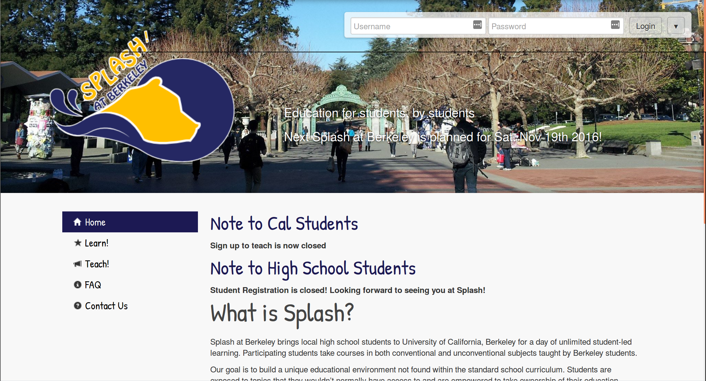

============================================
 ESP Website Stable Release 10 release notes
============================================

.. contents:: :local:

Changelog
=========

New theme: bigpicture
~~~~~~~~~~~~~~~~~~~~~

This release adds a new theme, "bigpicture", based on the custom theme written
by Sean Zhu and used by Splash at Berkeley.  This theme looks a bit more modern
than the existing ones, and should better fit the needs of new chapters.  See
the newly-expanded `themes documentation <../../themes.rst>`_ for how to set up
a new theme.

Here's a screenshot of it live on `Berkeley's site
<https://berkeley.learningu.org>`_:

   Figure 1: "bigpicture" theme on Berkeley's site

Deletion of login by birthday or school
~~~~~~~~~~~~~~~~~~~~~~~~~~~~~~~~~~~~~~~

Before this release, the website included the option for students to log in by
selecting their birthday or school from a list, and then selecting their
username from a list of all student accounts with that birthday or from that
school. This feature has been deleted because it leaks user data: anyone could
go through the list of birthdays or schools one by one and collect this
information for all of our students. Users having trouble logging in are now
encouraged to use the password reset page.

Diff view for template overrides
~~~~~~~~~~~~~~~~~~~~~~~~~~~~~~~~

You can now view a side-by-side diff of a template override and the original
template at the URL `https://esp.mit.edu/manage/templateoverride/<id>`, where
`<id>` is the id of the template override. This is linked to from the admin
panel page of the template override, via "View on Site".

Simplified student reg permissions
~~~~~~~~~~~~~~~~~~~~~~~~~~~~~~~~~~

TODO(mgersh): #2133

Lottery frontend program module
~~~~~~~~~~~~~~~~~~~~~~~~~~~~~~~

TODO(uakfdotb): #1038, #2328

Admin toolbar improvements
~~~~~~~~~~~~~~~~~~~~~~~~~~

The barebones theme now includes a user search box.

The fruitsalad theme now includes a class search toolbar, similar to its user
search toolbar. The class search toolbar allows users to quickly search through
classes of the program that is closest to "currently running" (using heuristics
described in `Program.current_program`).  Searching without a query will also
bring the user to the class search page, and searching for a class ID or class
code will bring the user directly to the manage page for that class.

Userview improvements
~~~~~~~~~~~~~~~~~~~~~

This release includes a number of improvements to the "user view" page.

- Teachers' names on manage class pages now link to user view.

- The list of classes now has links to the classes' manage and edit pages.

- You can now select a program to use for the quick links.

- The quick links now include a link to the user's accounting page, a new page
  that lists all costs and transactions that the user is involved in. This
  should make it easier to determine, for example, if a user has paid for a
  program.

- The page now clearly indicates if a user is deactivated.

Volunteer registration improvements
~~~~~~~~~~~~~~~~~~~~~~~~~~~~~~~~~~~

This release includes a number of improvements to the volunteer registration
functionality.

- Added a deadline for volunteer registration, which should be set separately
  for volunteers and teachers. Access to volunteer registration can be restricted
  to authenticated users by setting the ``volunteer_require_auth`` Tag to ``True``.

- Volunteer shifts may now be imported from a previous program.

- Volunteer schedules can now be printed.

- The nametag module can now create nametags for volunteers and other user
  groups.

- Volunteer registration statistics are now included in the program dashboard.

"Phase Zero" student lottery system
~~~~~~~~~~~~~~~~~~~~~~~~~~~~~~~~~~~

For programs in which there is more demand than supply, this student lottery system
allows a program to non-arbitrarily reduce the demand (based on the ``program_size_by_grade``
Tag) and ensure students in the program get enough classes in later phases of registration.
Provides a very simple student interface where students submit non-binding interest (which 
sends a confirmation email). This interface also allows students to combine into groups
of up to 4 students. If one student from the group is selected, all students will be
selected (provided there is room); however, if there isn't room for all students in the
group (due to grade caps), none of the students in the group will be selected (based on
simulations, this does not improve the chances of a student getting selected and may
actually decrease the chances of a student getting selected if they are in a group with
a student in a high-demand grade). The module also provides an admin interface to track
student lottery registration and run the lottery. When the lottery is run, the winners
will be given open-ended ``OverridePhaseZero`` and ``Student/All`` permissions, which 
will enable them to reach the other student registration phases. Also provides various
situational templates (e.g. to explain if students didn't win the lottery). Note: this
module should NOT be disabled upon the conclusion of the student lottery.

Improvements to editable text UI
~~~~~~~~~~~~~~~~~~~~~~~~~~~~~~~~

- The editable text interface now shows a small toolbar of three buttons when
  the user is editing text. Editable text is saved only when the user clicks
  the Save button, instead of when the user clicks out of the text area or it
  otherwise loses focus. Users can also Preview their edits or Cancel them.

- It is now possible to edit a page's title without editing its text.

Teacher Big Board
~~~~~~~~~~~~~~~~~

TODO(willgearty): #2396

Text message & email notification improvements
~~~~~~~~~~~~~~~~~~~~~~~~~~~~~~~~~~~~~~~~~~~~~~

- Can now text students when cancelling a class on the manageclass page (a la emailing
  lottery students). This functionality is hidden if GroupTextModule is not enabled
  or if Twilio is not configured*.
- Adds option to send a confirmation email to each of the teachers of a section/class
  when the section/class is cancelled on the manageclass page (a la emailing lottery
  students).
- Adds a button for each teacher on the check-in page that allows you to text them a
  reminder (provided Twilio is configured*) to check-in before their class. The text
  follows this format, but customized for the particular class: ``"Don't forget to
  check-in for your Splash class that is scheduled for 10-11:45 AM on April 9!"``
- Changes the text message profile form field to radio select buttons (rather than
  boolean). This forces new users to select one of the options, rather than defaulting
  to false. The field is only shown for students and if the ``text_messages_to_students``
  Tag is set to ``True``.

*Text message functionality requires setting Twilio configuration in local settings

Minor new features and fixes
~~~~~~~~~~~~~~~~~~~~~~~~~~~~

This release includes improvements to the styling of many pages, as well
as some performance improvements.  Other improvements and bug fixes include:

- The deadlines page now correctly shows the status of deadlines that are set
  to open in the future.

- Changing a class's status from "accepted but hidden" to "accepted" from
  the dashboard now works correctly.

- Editing a teacher's availability no longer clears their teacher training or
  interview signups.

- The scrolling class list now only shows class timeblocks.

- Lists of popular classes don't show up on the student reg big board when the
  lottery is not in use.

- The "consistency checks" on individual class manage pages have been removed;
  the scheduling checks module now runs these checks.

- Scheduling checks now have help text explaining what they do.

- You can now add a description when creating a teacher event (interview or
  training).

- It is now possible to hide the FAQ link in the fruitsalad theme.

- Student registration priorities now show up in the correct order.

- Students can now click a button on a class to rank it in phase 2 of the
  lottery.

- The lottery registration pages now show progress bars for the number of
  classes starred.

- The comm panel now has a filter for arbitrary user groups.

- The student reg big board now has line graphs of number of registrations.

- Class cancellation request emails now have a different subject line for each
  class, so they will go to separate threads.

- The onsite class changes grid now supports adding new students to the
  program.

- User morph will no longer fail on students with accents or other special
  characters in their names.

- The user profile options for "graduate student" and "currently enrolled at
  [institution]" have been replaced with a single "specify your affiliation"
  question.

- Applying updates to themes should work more consistently.

- Several bugs in schedule generation are fixed, and the page now gives better
  error text when things go wrong.

- The scheduler now works correctly with classroom names containing commas.

- The class search module now has a "title containing" filter and some
  additional styling.

- Teacher check-in now has an undo check-in button.

- Fruitsalad pages now have toolbars for editing the navigation bars.

- Grade range help text in the class registration form is now customizable like
  the other fields.

- Added an option to allow teachers to specify a "class style", e.g. lecture
  vs. seminar.  To enable class styles, admins should set the Tag
  ``class_style_choices`` with value in the following JSON format, where the
  first element of each list is the value stored in the database, and the
  second value is the option shown on the form:
  ``[["Lecture", "Lecture Style Class"], ["Seminar", "Seminar Style Class"]]``.

- The K12School admin page no longer crashes.

- Administrators viewing pages which are not accessible to all users will see a
  warning telling them which roles can currently access the page.

- Invalid barcodes no longer cause an error in bulk student check-in.

- The student catalog now allows filtering by grade level rather than showing
  all classes when logged out.

- Room schedules are now sorted alphabetically in the printable.

- Teacher registration now allows setting fixed grade range options, rather
  than allowing any min/max.

- Teachers can now click a button to request that their class be cancelled, if
  they have the ``Teacher/Classes/CancelReq`` permission.  This replaces the
  formerly broken "delete" button.

- The lunch constraint page now clobbers old lunch blocks, allowing lunch
  constraints to be edited.

- The address field in teacher profile may be made optional by setting the
  ``teacher_address_required`` Tag to ``False``.

- Medical bypasses can be added, removed, or queried with a new interface.
